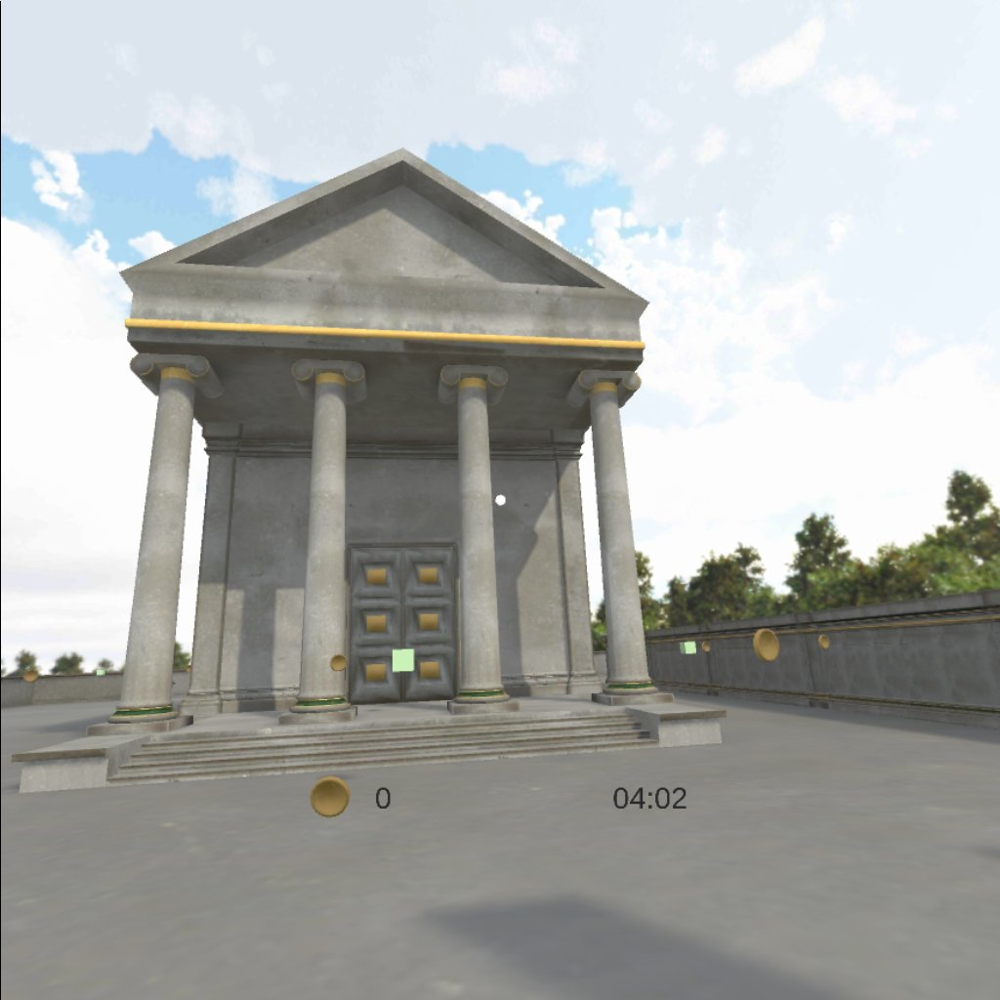

# Udacity VR Foundations Nanodegree
## A Maze - Davide Zordan

# Introduction 
Explore the maze, collect the coins and find the treasure!

The original project has been extended with the following functionalities:
- added splash screen and game over scenes.
- added coins counter on overlay menu.
- added customizable timer.

# Getting Started

### Build and Test
It's possible to test the project using Unity. If Unity is not available, an apk has been provided and can be deployed directly to an Android device.
The project has been tested using both Google Cardboard and Oculus Go but the provided apk is targeting only Google Cardboard.

#### Using Unity
Scenes required (the order should be respected): 
- A Maze\Assets\_Scenes\Loading.Unity
- A Maze\Assets\_Scenes\Main.unity
- A Maze\Assets\_Scenes\GameOver.Unity

Steps:
- Unzip the zip file
- Launch Unity (the project is targeting Unity 2017.4.15f1)
- Open the project located under the folder “A Maze"
- Open the scene "A Maze" to explore the hierarchy
- VR mode has been set on the Android build platform in the Build settings
- Use the menu “File->Build settings->Android->Build and Run” to run it on an Google Cardboard device. Replace the target if another platform (like Oculus Go) is required
- Explore the scene in the headset

#### Deploy to the device
If needed, a build targeting Google Cardboard has already been provided compressed into the archive "Build.zip" and can be deployed to a device using the following command from an adb command prompt:

##### adb install "AMaze.apk”

### Versions Used
- [Unity LTS Release 2017.4.15](https://unity3d.com/unity/qa/lts-releases?version=2017.4)
- [GVR SDK for Unity v1.170.0](https://github.com/googlevr/gvr-unity-sdk/releases/tag/v1.170.0)

### Related Repositories
- [VR Software Development - A Maze](https://github.com/udacity/VR-Software-Development_A-Maze)
- [FPS script](http://wiki.unity3d.com/index.php/FramesPerSecond)
